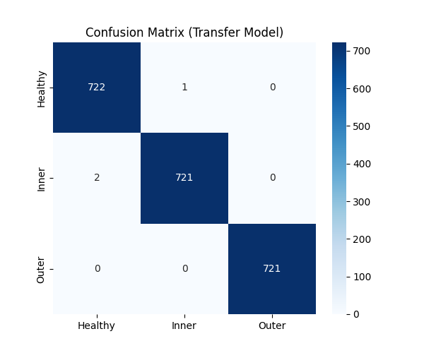
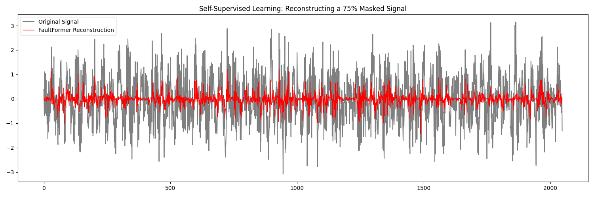

# ===========================================
#                 Faultformer
# Cross-Domain Bearing Fault Diagnosis using
# Transformer-Based Architectures
# ===========================================

<div align="center">


**From CWRU to Paderborn: Bridging the Sim-to-Real Gap in Predictive Maintenance**

[Overview](#-overview) •
[Results](#-results) •
[Installation](#-installation) •
[Usage](#-usage) •
[Architecture](#-architecture) •
[Citation](#-citation)

</div>

---

## 📋 Overview

**FaultFormer** is a Transformer-based deep learning framework for cross-domain bearing fault diagnosis. It addresses the critical **"Sim-to-Real" gap** in predictive maintenance by leveraging transfer learning from synthetic laboratory data to real-world fatigue damage.

### The Problem

- **Data Scarcity Paradox**: High-quality labeled data of real machinery faults is rare and expensive
- **Domain Shift**: Models trained on artificial lab faults (drilled holes) fail on real fatigue damage (pitting, spalling)
- **Generalization**: CNNs struggle with the stochastic, noisy nature of real-world vibration signals

### Our Solution

1. **Self-Supervised Pretraining** on abundant CWRU dataset using Masked Signal Modeling
2. **Transfer Learning** to Paderborn real damage dataset
3. **Transformer Architecture** with Rotary Positional Embeddings for long-range dependencies

---

## 🎯 Results

| Metric | Transfer Learning | From Scratch |
|--------|-------------------|--------------|
| **Accuracy** | **99.77%** | 86.4% |
| **Convergence** | Fast (< 5 epochs) | Slow (> 12 epochs) |
| **Precision (Inner Race)** | 0.99 | 0.82 |
| **Recall (Outer Race)** | 1.00 | 0.88 |

### Confusion Matrix



### Signal Reconstruction (Pretraining Proof)



---

## 🏗️ Architecture

```
┌─────────────────────────────────────────────────────────────────────┐
│                        FaultFormer Architecture                     │
├─────────────────────────────────────────────────────────────────────┤
│                                                                     │
│   Input Signal (2048 samples, 1 channel)                            │
│              │                                                      │
│              ▼                                                      │
│   ┌─────────────────────────────────────────────┐                   │
│   │         Hierarchical CNN Tokenizer           │                  │
│   │  Conv1D (k=10, s=4) → BatchNorm → GELU      │                   │
│   │  Conv1D (k=3, s=4) → BatchNorm → GELU       │                   │
│   │                                              │                  │
│   │  Output: 128 tokens × 64 dimensions         │                   │
│   └─────────────────────────────────────────────┘                   │
│              │                                                      │
│              ▼                                                      │
│   ┌─────────────────────────────────────────────┐                   │
│   │       Positional Embeddings (Learnable)      │                  │
│   └─────────────────────────────────────────────┘                   │
│              │                                                      │
│              ▼                                                      │
│   ┌─────────────────────────────────────────────┐                   │
│   │         Transformer Encoder × 4              │                  │
│   │  ┌───────────────────────────────────────┐  │                   │
│   │  │  LayerNorm → Multi-Head Attention     │  │                   │
│   │  │  (4 heads, RoPE support)              │  │                   │
│   │  │  LayerNorm → FFN (128 → 64)           │  │                   │
│   │  │  Residual Connections + Dropout       │  │                   │
│   │  └───────────────────────────────────────┘  │                   │
│   └─────────────────────────────────────────────┘                   │
│              │                                                      │
│              ▼                                                      │
│   ┌─────────────────────────────────────────────┐                   │
│   │  Global Average Pooling → Dense(Softmax)    │                   │
│   │                                              │                  │
│   │  Output: 3 classes (Healthy, Inner, Outer)  │                   │
│   └─────────────────────────────────────────────┘                   │
│                                                                     │
│   Total Parameters: ~141,000                                        │
└─────────────────────────────────────────────────────────────────────┘
```

### Key Components

- **CNN Tokenizer**: Converts raw 1D signal to sequence of embeddings (16× downsampling)
- **Transformer Encoder**: 4 layers with Pre-LayerNorm for stable training
- **RoPE (Rotary Positional Embeddings)**: Encodes relative position for periodic signals
- **Classification Head**: Global pooling + Dense layer for fault diagnosis

---

## 📁 Project Structure

```
faultformer/
├── README.md                      # This file
├── LICENSE                        # MIT License
├── requirements.txt               # Python dependencies
├── .gitignore                     # Git ignore rules
│
├── src/                           # Source modules
│   ├── __init__.py
│   ├── data/                      # Data loaders
│   │   ├── __init__.py
│   │   ├── cwru_loader.py         # CWRU dataset manager
│   │   ├── paderborn_loader.py    # Paderborn dataset loader
│   │   └── pipeline.py            # Preprocessing pipeline
│   │
│   └── models/                    # Model architecture
│       ├── __init__.py
│       ├── layers.py              # Custom layers (RoPE, Transformer)
│       ├── faultformer.py         # Main model builder
│       └── pretrain_utils.py      # Self-supervised utilities
│
├── scripts/                       # Training scripts
│   ├── phase3_pretraining.py      # Self-supervised pretraining
│   ├── phase4_transfer_learning.py # Transfer learning
│   └── phase5_dashboard.py        # Gradio web interface
│
├── data/                          # Datasets (gitignored)
│   ├── cwru/                      # CWRU .mat files
│   └── paderborn/                 # Paderborn .mat files
│
├── weights/                       # Model weights (gitignored)
│   ├── faultformer_pretrained.weights.h5
│   └── phase4_final.weights.h5
│
└── assets/                        # Figures and results
    ├── confusion_matrix.png
    └── reconstruction_proof.png
```

---

## 🚀 Installation

### Prerequisites

- Python 3.10+
- macOS/Linux (Windows with WSL)
- For Paderborn dataset: `unar` command-line tool

### Setup

```bash
# Clone the repository
git clone https://github.com/yourusername/faultformer.git
cd faultformer

# Create virtual environment
python -m venv .venv
source .venv/bin/activate  # On Windows: .venv\Scripts\activate

# Install dependencies
pip install -r requirements.txt

# Download pre-trained weights
python scripts/download_weights.py

# Install unar for Paderborn RAR extraction (macOS)
brew install unar
```

### Pre-trained Weights

The model weights are hosted on Google Drive. Download automatically or manually:

**Automatic Download:**
```bash
python scripts/download_weights.py
```

**Manual Download:**

| File | Description | Size | Link |
|------|-------------|------|------|
| `faultformer_pretrained.weights.h5` | Phase 3: Self-supervised (CWRU) | 1.9 MB | [Download](https://drive.google.com/uc?export=download&id=1LHlYDG208ozm45U0vh8nLvmh4DKIbSUR) |
| `phase4_final.weights.h5` | Phase 4: Transfer learning (Paderborn) | 1.8 MB | [Download](https://drive.google.com/uc?export=download&id=1K9YC3hiw1TLPkMOZ4K-LN0PsHq7PhTe2) |

Place downloaded files in the `weights/` folder.

---

## 📊 Usage

### Phase 3: Self-Supervised Pretraining

Train the model to reconstruct masked vibration signals on CWRU dataset:

```bash
python scripts/phase3_pretraining.py
```

**Output:** `weights/faultformer_pretrained.weights.h5`

### Phase 4: Transfer Learning

Fine-tune on Paderborn real-world damage dataset:

```bash
python scripts/phase4_transfer_learning.py
```

**Output:** 
- `weights/phase4_final.weights.h5`
- `assets/phase4_confusion_matrix.png`
- `assets/phase4_comparison_result.png`

### Phase 5: Interactive Dashboard

Launch the Gradio web interface for real-time diagnosis:

```bash
python scripts/phase5_dashboard.py
```

Access the dashboard at `http://127.0.0.1:7860`

**Features:**
- Upload `.mat` vibration files
- Real-time fault diagnosis
- Saliency map visualization (model attention)
- Confidence scores

---

## 📚 Datasets

### CWRU (Source Domain)

| Condition | File IDs | Description |
|-----------|----------|-------------|
| Normal | 97-100 | Healthy bearing (0-3 HP load) |
| Inner Race | 105-108 | 0.007" EDM fault |
| Ball | 118-121 | 0.007" EDM fault |
| Outer Race | 130-133 | 0.007" EDM fault |

**Sampling Rate:** 12 kHz / 48 kHz  
**Source:** [CWRU Bearing Data Center](https://engineering.case.edu/bearingdatacenter)

### Paderborn (Target Domain)

| Code | Condition | Damage Type |
|------|-----------|-------------|
| K001 | Healthy | Undamaged bearing |
| KI04 | Inner Race | Real fatigue (pitting) |
| KA04 | Outer Race | Real fatigue (pitting) |

**Sampling Rate:** 64 kHz  
**Source:** [Paderborn University](https://mb.uni-paderborn.de/kat/forschung/datacenter/bearing-datacenter)

---

## ⚙️ Configuration

### Model Hyperparameters

```python
# Architecture
embed_dim = 64        # Token embedding dimension
num_heads = 4         # Attention heads
ff_dim = 128          # Feed-forward dimension
num_layers = 4        # Transformer layers

# Training
batch_size = 32
learning_rate = 1e-4  # (Transfer learning)
epochs = 15

# Preprocessing
window_size = 2048    # Signal window length
stride = 1024         # Overlap between windows
target_sr = 12000     # Target sampling rate
```

---

## 🔬 Methodology

### 1. Physics Alignment

Before transfer learning, we align the physical characteristics:

- **Resampling:** Paderborn 64kHz → 12kHz (matching CWRU)
- **Segmentation:** 2048-sample windows with 50% overlap
- **Normalization:** Z-score standardization per window

### 2. Self-Supervised Pretraining (Phase 3)

Using **Masked Signal Modeling** (MSM):
- Randomly mask 75% of input signal
- Model learns to reconstruct original signal
- Captures fundamental vibration physics

### 3. Transfer Learning (Phase 4)

- Load pretrained encoder weights
- Freeze CNN Tokenizer (feature extractor)
- Fine-tune Transformer + Classification Head
- Train on limited Paderborn data

---

## 📝 Citation

If you use this code in your research, please cite:

```bibtex
@article{faultformer2025,
  title={Cross-Domain Bearing Fault Diagnosis using Transformer-Based Architectures},
  author={Your Name},
  journal={Advanced Topics in Machine Learning},
  year={2025}
}
```

### References

1. Smith, W. A., & Randall, R. B. (2015). Rolling element bearing diagnostics using the Case Western Reserve University data. *Mechanical Systems and Signal Processing*.

2. Lessmeier, C., et al. (2016). Condition Monitoring of Bearing Damage in Electromechanical Drive Systems. *PHM Society European Conference*.

3. Zhou, A., et al. (2023). FaultFormer: Transformer-based Prediction of Bearing Faults. *arXiv:2312.02380*.

4. Vaswani, A., et al. (2017). Attention is all you need. *NeurIPS*.

---

## 📄 License

This project is licensed under the MIT License - see the [LICENSE](LICENSE) file for details.

---

## 🤝 Contributing

Contributions are welcome! Please feel free to submit a Pull Request.

1. Fork the repository
2. Create your feature branch (`git checkout -b feature/AmazingFeature`)
3. Commit your changes (`git commit -m 'Add some AmazingFeature'`)
4. Push to the branch (`git push origin feature/AmazingFeature`)
5. Open a Pull Request

---

## 📧 Contact

**Mukhammadali Bakhodirov 🇺🇿** - uzbekswe@gmail.com

Project Link: [https://github.com/Uzbekswe/faultformer](https://github.com/Uzbekswe/faultformer)

---

<div align="center">

**⭐ Star this repository if you find it useful! ⭐**

</div>
